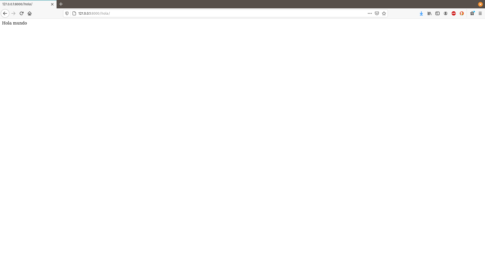

<p align="center">

</p>


# Tutorial 8: Django


### Contenido:

1. ¿Qué es *Django*?
2. ¿Por qué usar *Django*?
3. Instalación 
4. Creación de proyectos
5. Servidor de desarrollo
6. Primera Página *Django ("Hola mundo")*
7. Referencias


### 1. ¿Qué es Django?


***Django*** es un framework web de código abierto escrito en *Python*. El objetivo de *Django* es facilitar la creación de sitios web complejos, poniéndole énfasis en el re-uso, la conectividad y expansibilidad de componentes.
******
### 2. ¿Por qué usar django?

* **Rapidez:**
Con *django* podemos construir buenas aplicaciones en poco tiempo, especialmente si se tenemos una *startup* y tenemos prisa por terminar nuestro proyecto, además de reducir costes.

* **Seguridad:** 
Django implementa de por si algunas medidas de seguridad, como por ejemplo, para que no haya SQL Injectionm, Cross site request forgery(CSRF) o Clickjacking por JavaScript.

* **Escalabilidad:**
Este framework nos permite pasar desde un aplicación pequeña a aplicación enorme que sea modular y que funcione rápido y que además sea estable.

* **Versatilidad** 
Django comenzó siendo un Framework para almacenar noticias de sitios de prensa, blogs, pero hoy en día ha ganado mucha popularidad y puede usarse en webs de cualquier propósito. Entre las webs destacadas que usan *django* encontramos National Geografic, Instagram, Pinterest, Mozila Foundation, entre otras.


****

 ### 3. Instalación

Descarga en la página oficial de [django](https://www.djangoproject.com/download/) .

**Opción 1:** 

Instalamos la versión oficial, usando pip:

`pip install Django==3.1.5`

**Opción 2:**

Desde el repositorio git podemos descargar la versión de desarrollo:

`git clone https://github.com/django/django.git`


****

### 4. Creación de proyectos

Creamos un directorio local donde se encontrará nuestro proyecto:

`$ mkdir djangoproyect`

`$ cd djangoproyect`

Luego ejecutamos el siguiente comando que creará un directorio llamado proyecto1 en el directorio actual:

`$ django-admin startproject proyecto1`

El comando `startproeyct` crea los siguientes archivos:

````````
proyecto1/
    manage.py
    proyecto1/
        __init__.py
        settings.py
        urls.py
        asgi.py
        wsgi.py

````````

* **proyecto1:** El directorio raíz externo **proyecto1/** solo es un contenedor de nuestro proyecto(El nombre no es relevante para Django).

* **manage.py:**  Una utilidad de la línea de comandos que le permite interactuar con este proyecto *Django* de diferentes formas.

* **proyecto1/__init__.py:** archivo vacío que le indica a *Python* que este directorio debería ser considerado como un paquete *Python*.

* **proyecto1/settings.py:** Ajustes/configuración para este proyecto Django (para más información ver [Django Settings](https://docs.djangoproject.com/es/3.1/topics/settings/)).


* **proyecto1/urls.py:** declaraciones URL para este proyecto *Django*; una «tabla de contenidos» nuestro sitio basado en *Django* (más información [URL dispatcher](https://docs.djangoproject.com/es/3.1/topics/http/urls/)).

* **proyecto1/asgi.py:** punto de entrada para servidores web compatibles con ASGI.

* **proyecto1/wsgi.py**: Un punto de entrada para que los servidores web compatibles con WSGI.

**** 
### 5. Servidor de desarrollo
Django viene con un servidor ligero(escrito en *python*) para realizar pruebas, no es recomendado usarlo para proyectos grandes pues no admite peticiones simultaneas, y cargas de trabajo pesadas.

Ejecutando  el siguiente comando iniciamos el servidor de desarrollo:

`$ python manage.py runserver`

Con esto ya tenemos el servidor funcionando, podemos comprobarlo visitando la dirección `http://127.0.0.1:8000/` en nuestro navegador y debería mostrar lo siguiente: 


<p align="center">

</p>

**NOTA:** El comando `runserver`, inicia de manera predeterminada en la IP interna del puerto 8000. Podemos cambiarlo, pasando el puerto que deseamos en la línea de comandos, por ejemplo: 

`$ python manage.py runserver 8080`

***
### 6. Primera página en *Django ("Hola mundo")*

* **Creación de la primera vista(***view***)**

	Para realizar la solicitudes Django trabajará con con la clase *HttpRequest*, y para las respuestas con la clase *HttpResponse*.

	Creamos un nuevo archivo en las carpeta del proyecto que corresponderá a las "vistas" que vayamos almacenando. Por convención a dicho archivo se denomina *views.py*.

	Documentación [Request and response objects](https://docs.djangoproject.com/es/3.1/ref/request-response/).

	Cuando una pagina es solicitada, *django* crea un un objeto **HttpRequest** que contiene los metadatos de la solicitud. Luego *django* carga la vista apropiada pasando como primer argumento el **HttpRequest** de la función *view*. Cada *view* es responsable de retornar un objeto **HttpResponse**.

	Los objetos **HttpRequest** y **HttpResonse**, están definidos en el módulo **django.http**, por lo tanto tendremos que importarlos.

	En *views.py* creamos nuestra primera vista:

	````````
	from django.http import HttpResponse

	def holamundo(request): 
	    return HttpResponse("Hola mundo")

* **Configuración de la URL**

	 Ahora debemos decirle a *Python* cuál será la url que debemos introducir en el navegador para ir a la vista que hemos creado, por lo tanto debemos enlazar la vista `def holamundo(request)` para que nos devuelva *"Hola mundo"*. 

	Modificamos ahora el archivo *urls.py* para enlazar a nuestra primera vista. Añadimos la url que vamos a usar para realizar el enlace, la llamaremos *hola*:

	~~~~
	"""proyecto1 URL Configuration

	The `urlpatterns` list routes URLs to views. For more 	information please see:
	    https://docs.djangoproject.com/en/3.1/topics/http/urls/	
	Examples:
	Function views	    
		1. Add an import:  from my_app import views
    	2. Add a URL to urlpatterns:  path('', views.home, name='home')
	Class-based views
	    1. Add an import:  from other_app.views import Home
    	2. Add a URL to urlpatterns:  path('', Home.as_view(), name='home')

	Including another URLconf
		1. Import the include() function: from django.urls import include, path
		2. Add a URL to urlpatterns:  path('blog/', include('blog.urls'))
	"""
		
	from django.contrib import admin
	from django.urls import path
	from proyecto1.views import holamundo
	
	urlpatterns = [
    path('admin/', admin.site.urls),
    path('hola/', holamundo),
	]

	~~~~

Ahora probamos (debemos asegurarnos de que nuestro servidor de prueba esté encendido), e introducimos la url que acabamos de marcar. Desde nuestro navegador: 

`http://127.0.0.1:8000/hola/`

<p align="center">

</p>


***

### 7. Referencias: 

* django project [[1](https://www.djangoproject.com/)].


